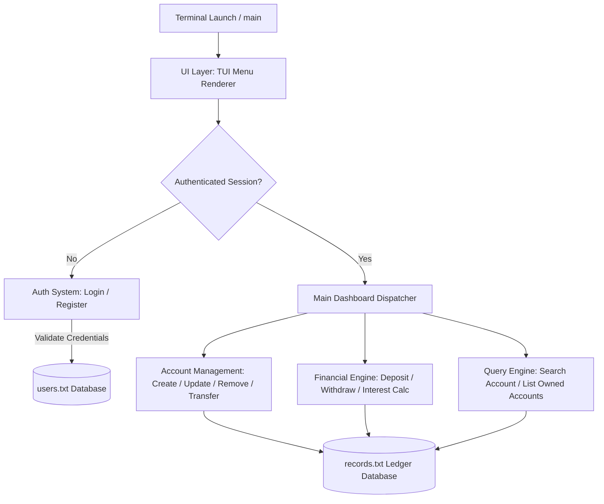
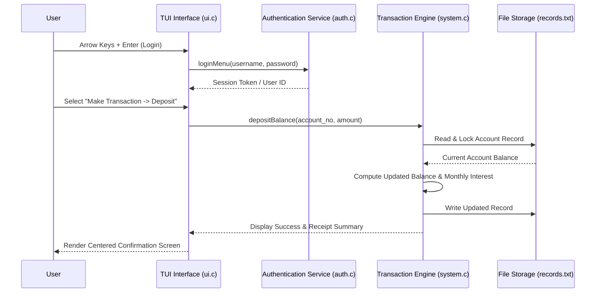

# 🏦 ApexVault

[](https://en.wikipedia.org/wiki/C_(programming_language))
[](LICENSE.md)
[](#-getting-started)

**ApexVault** is a terminal-based financial management engine and banking system implemented in C. Featuring a centered Text User Interface (TUI) with interactive arrow-key navigation, secure password masking, dynamic interest reward calculations, and multi-account ledger persistence.

---

## ✨ Features

- **Centered TUI Layout**: Double-line boxed interface rendered with ASCII border alignment.
- **Keyboard Navigation**: Interactive selection with `UP`/`DOWN` arrow keys, `ENTER` selection, and instant `ESC` cancel.
- **Authentication Security**: User signup/login authentication with password masking (`*`) and persistent credentials storage.
- **Multi-Account Support**: Manage Savings, Fixed, and Current account types with individual deposit dates, balances, and account ownership transfer capabilities.
- **Financial Transactions**: Deposit/withdraw routines with real-time balance validation and interest reward calculation.
- **Input Validation**: Strict error handling for invalid account IDs, dates, and non-numeric inputs.

---

## 📋 Table of Contents

- [Features](#-features)
- [System Architecture](#-system-architecture)
- [State Machine & Transaction Flow](#-state-machine--transaction-flow)
- [Getting Started](#-getting-started)
- [Project Structure](#-project-structure)
- [License](#-license)

---

## 🏗️ System Architecture



---

## 📐 State Machine & Transaction Flow



---

## 🚀 Getting Started

### Prerequisites

- **C Compiler**: GCC or Clang
- **Make**: Build utility

### Build & Run

1. **Clone Repository**:
   ```bash
   git clone https://github.com/sahmedhusain/apex-vault.git
   cd apex-vault
   ```

2. **Compile Application**:
   ```bash
   make
   ```

3. **Launch ApexVault**:
   ```bash
   ./apex-vault
   ```

---

## 📂 Project Structure

```
apex-vault/
├── Makefile         # Build rules and dependencies
├── LICENSE.md       # MIT License
├── README.md        # Documentation
├── data/            # Local database storage
│   ├── users.txt    # User credentials store
│   └── records.txt  # Bank account ledger records
└── src/
    ├── main.c       # Application bootstrapper and main loop
    ├── auth.c       # Authentication & user registration routines
    ├── system.c     # Account CRUD operations and financial calculations
    ├── ui.c         # Centered TUI box renderer & keyboard reader
    └── header.h     # Core structs and function signatures
```

---

## 📄 License

Distributed under the MIT License. See [LICENSE](LICENSE.md) for details.
